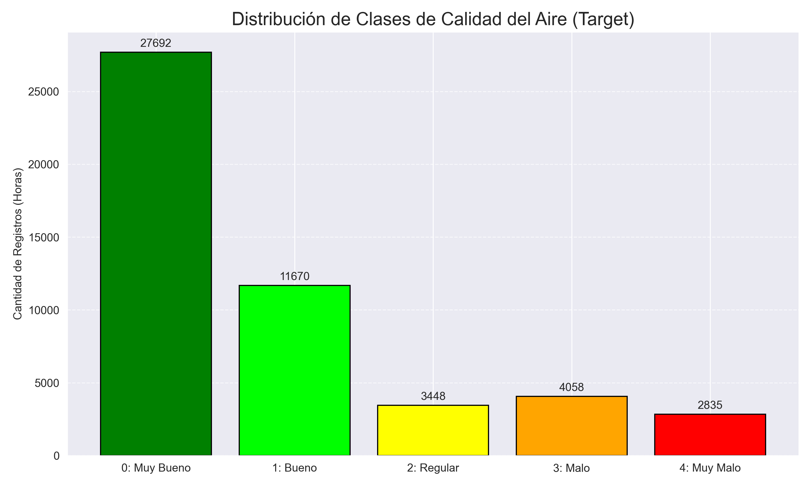
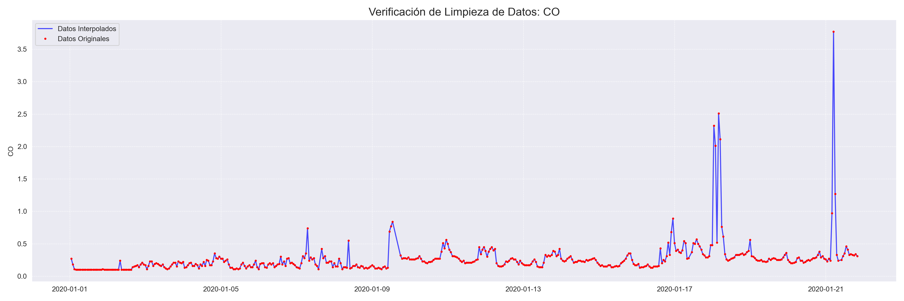
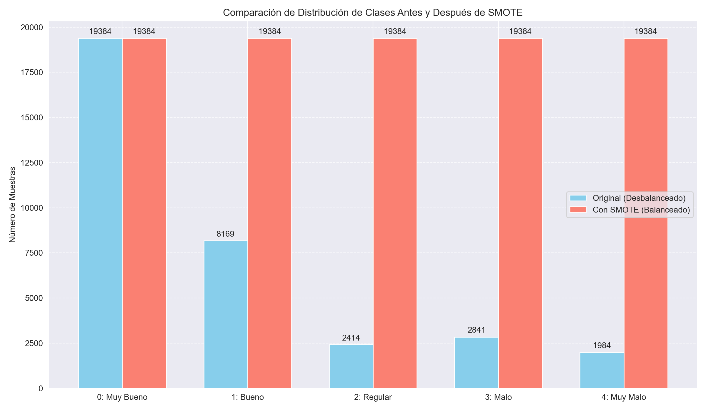
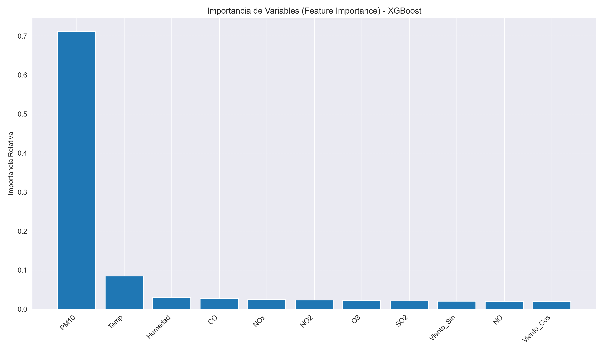

# 🌍 Predicción de Calidad del Aire con Machine Learning (XGBoost)

Este repositorio contiene el **Proyecto Final de Machine Learning**, enfocado en desarrollar un sistema predictivo de alertas tempranas para la calidad del aire (PM2.5). 

El modelo clasifica la calidad del aire en 5 niveles (Desde "Muy Bueno" a "Muy Malo") utilizando datos meteorológicos y de contaminantes químicos, priorizando la detección de emergencias ambientales mediante técnicas avanzadas de balanceo de datos.

## 🚀 Características Principales

* **Enfoque de Clasificación:** Transformación del problema de regresión a clasificación multiclase para generar alertas sanitarias.
* **Ingeniería de Datos Robusta:** Limpieza de nulos mediante interpolación, vectorización de viento y análisis PCA.
* **Manejo de Desbalance:** Aplicación de **SMOTE** para garantizar la detección de la clase minoritaria "Muy Malo".
* **Modelado Comparativo:** Evaluación entre Random Forest, KNN y XGBoost.
* **Sistema de Inferencia:** Script funcional para predicciones en tiempo real.

## 📂 Estructura del Proyecto

El flujo de trabajo se divide en 5 notebooks secuenciales:
1.  `1_Analisis_Exploratorio.ipynb`: Auditoría y EDA.
2.  `2_Procesamiento_Datos.ipynb`: Unificación, limpieza y Feature Engineering.
3.  `3_PCA_y_Balanceo_SMOTE.ipynb`: Reducción de dimensionalidad y SMOTE.
4.  `4_Entrenamiento_Evaluacion.ipynb`: Entrenamiento y métricas comparativas.
5.  `5_Codigo_Inferencia.ipynb`: Sistema de predicción final.

---

## 🔬 Análisis y Metodología Visual

### 1. El Desafío: Desbalance de Clases
El dataset original presentaba un severo desbalance, con muy pocos registros de emergencias ambientales ("Muy Malo"). Entrenar así habría sesgado el modelo.



### 2. Limpieza de Datos (Interpolación Temporal)
Se detectó ~20% de nulos en variables críticas. En lugar de eliminar registros, utilizamos interpolación lineal basada en el tiempo para reconstruir la continuidad climática.


*(Línea azul: Datos recuperados por interpolación | Puntos rojos: Datos originales)*

### 3. Reducción de Dimensionalidad (PCA)
El análisis de componentes principales (PCA) confirmó la alta redundancia entre los gases nitrogenados (NO, NO2, NOx), permitiendo simplificar el análisis.


### 4. Solución: Balanceo con SMOTE
Aplicamos SMOTE (Synthetic Minority Over-sampling Technique) exclusivamente al set de entrenamiento para igualar la representación de todas las clases.



---

## 📊 Resultados del Modelo (XGBoost)

Tras comparar Random Forest, KNN y XGBoost, seleccionamos **XGBoost** por su eficiencia y robustez.

### Rendimiento Global
* **Accuracy Global:** ~86%
* **Recall en Clase "Muy Malo" (Emergencia):** **0.97** (El modelo detecta el 97% de las emergencias reales).

### Curvas ROC Comparativas
Ambos modelos líderes mostraron un excelente desempeño (AUC ~0.98), pero XGBoost ofrece mayor velocidad de inferencia.


### Interpretabilidad del Modelo
El análisis de importancia de variables reveló que **PM10** es el predictor dominante, validando la coherencia física del modelo (correlación entre partículas gruesas y finas).



---

## 🛠️ Instalación y Requisitos

1.  Clonar el repositorio:
    ```bash
    git clone [https://github.com/NicolasFluxa/Prediccion-Calidad-Aire-ML.git](https://github.com/NicolasFluxa/Prediccion-Calidad-Aire-ML.git)
    ```
2.  Instalar dependencias:
    ```bash
    pip install -r requirements.txt
    ```

## 📝 Dataset

El dataset unificado consta de **49,703 registros** horarios con 11 variables predictoras (Químicas y Meteorológicas).

## ✒️ Autores

* **Nicolás Fluxá Morán** - *Desarrollo y Modelado*
* **Felipe Arevalo Galaz** - *Desarrollo y Modelado*

---
*Proyecto realizado para la asignatura de Machine Learning - 2025.*
